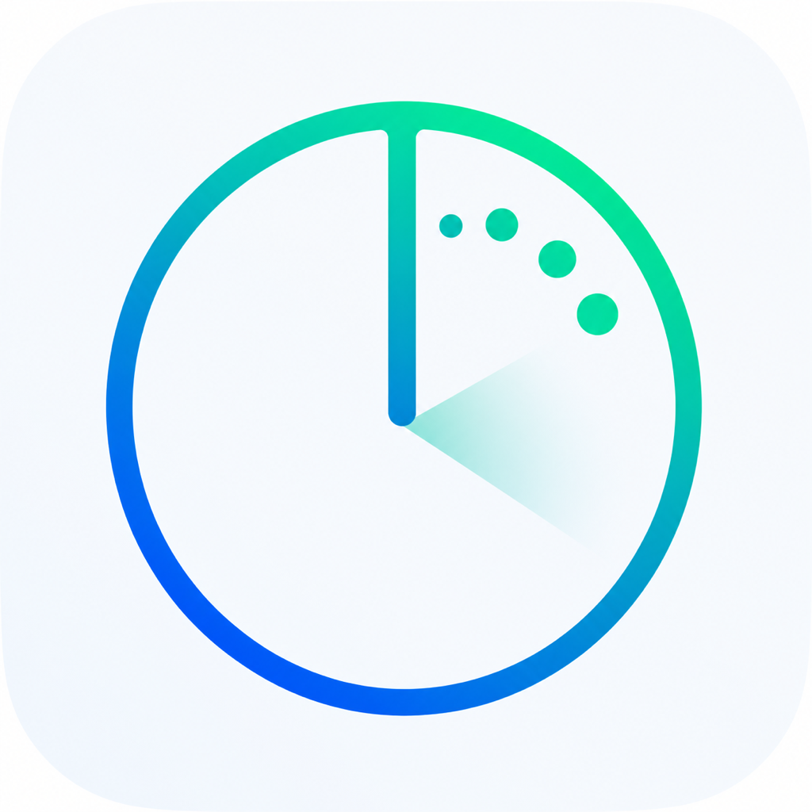

# Opportunity Radar

<p align="center"></p>

[](https://github.com/hadronic-arvind/opportunity-radar/actions/workflows/ci.yml)
[](LICENSE)

Opportunity Radar collects opportunities from official sources, compares them with your preferences, and keeps your search in a private local dashboard.

It runs in short bursts and exits after each scan.
Nothing polls in the background, and no local web server is opened.
The setup and operation instructions below are for the copyright holder and anyone who has received prior written permission under the [proprietary license](LICENSE).

## Quick start

Requirements are Python 3.9 or newer on macOS or another Unix-like system.
The scanner has no third-party Python dependencies.
Building the optional macOS app also requires the Apple Command Line Tools (`xcode-select --install`).

```bash
git clone https://github.com/hadronic-arvind/opportunity-radar.git
cd opportunity-radar
python3 -m monitor init
./scripts/run_now.sh
./scripts/open_dashboard.sh
```

`init` creates private, ignored configuration files and lets you choose a target-aware STEM coverage preset, source packs, preferred work, locations, organizations, and a default resume or CV label.
Automatic coverage is the default and derives a broad source mix from the roles, fields, skills, career stage, and opportunity types in that profile.
Choosing a named field preset also seeds practical role, domain, and skill targets that remain editable.
Skip it to use the neutral starter profile and five diverse structured feeds.

## Choose an interface

The CLI works immediately and installs no app.

```bash
./scripts/open_dashboard.sh
python3 -m monitor scan
```

On macOS, the native app is optional.
It opens the dashboard directly and enables named profiles, profile editing, Refresh, Scan all, Save, and application-status controls.

```bash
./scripts/install_launch_agent.sh
python3 extras/macos-app/install.py
```

The schedule and app are independent, so you can omit either one.

Add `--desktop-shortcut` only if you want an icon on the Desktop.

```bash
python3 extras/macos-app/install.py --desktop-shortcut
```

Cloning the repository never creates an app or Desktop icon by itself.

## Daily use

The macOS scheduler checks due sources at 07:30 and 16:30 local time, then exits.
Open Opportunity Radar whenever you want to review the latest dashboard.
Use Refresh for due sources or Scan all when you deliberately want to ignore source cadences.

Without the app, use `python3 -m monitor scan` for a due-only refresh or `./scripts/run_now.sh` for a full scan.
`./scripts/open_dashboard.sh` opens immediately and does not wait for the network.

The Discover view supports field-aware search, sorting, filters, saved items, a compact system/light/dark selector, and 24-item pages.
In the native app, Plan application and Mark applied persist the workflow in SQLite.
In a regular browser, the same controls use bounded local browser storage because a static file cannot safely write to SQLite.

Your profile can be changed at any time from the native app or the CLI.

```bash
python3 -m monitor profile show
python3 -m monitor profile set \
  --timeframe "Summer 2028" \
  --include "scientific computing,machine learning" \
  --opportunity-types "internship,research_program" \
  --coverage-preset automatic
python3 -m monitor profile validate
```

Profile changes immediately rescore the existing dashboard without a network request.
Every later due or forced scan reads the latest saved profile.
If a scan is already running, the app keeps the profile editor available and applies one saved update immediately afterward, so the active scan finishes with its original snapshot and the next scan uses the new profile.
The app keeps personal goals on Basics, searchable source packs on Sources, and scoring, matching rules, and document routing on Advanced.
Removing a basic role or domain retires obsolete positive advanced rules tied only to the removed target, while retained cross-domain, negative, qualification, and hard-gate rules stay intact.

Create a complete named profile in one shot from versioned JSON, including JSON drafted from a resume by an AI model.

```bash
python3 -m monitor profile template > my-profile.json
python3 -m monitor profile import --file my-profile.json --dry-run
python3 -m monitor profile import --file my-profile.json
```

The app offers the same flow through **Import JSON**.
Location choices use an embedded offline city, state, and country hierarchy, so selecting a country also matches listings that name only a city in that country.
Degree entry separates normalized degree level from a suggested field of study.
Enrollment restrictions distinguish undergraduate, master's, and doctoral candidates without treating a minimum degree as a maximum.
The optional citizenship filter supports multiple citizenships, permanent residency, and U.S. national status; incomplete requirements remain flagged for review.
See [Configuration](docs/CONFIGURATION.md#one-shot-profile-import) for the complete format.

Save separate profiles for different people, disciplines, career stages, or search strategies, then activate the one that should control sources and matching.

```bash
python3 -m monitor profile list
python3 -m monitor profile create "Clinical research"
python3 -m monitor profile duplicate "Clinical research" "Public health"
python3 -m monitor profile activate "Public health"
python3 -m monitor profile rename "Public health" "Epidemiology"
python3 -m monitor profile delete "Clinical research"
```

Activating a profile atomically changes its matching preferences and source packs, rescores existing opportunities, and rebuilds the dashboard.
Bookmarks and application status remain shared, so switching profiles never loses workflow history.

Fit scores are deterministic triage from your rules.
They are not acceptance probabilities.

## Sources and customization

The public catalog contains 274 official resources across computing, mathematical sciences, physics, quantum science, astronomy, chemistry, materials, Earth and geospatial science, ecology, environment, agriculture, food science, medicine, clinical research, public health, pharma, neuroscience, civil infrastructure, electronics, semiconductors, ocean science, veterinary science, and the original cross-industry packs.
It includes 115 automated listing feeds, with 39 feeds spanning medicine, clinical research, biotech, pharma, public health, and neuroscience.
The five-source starter stays small, while the broader packs remain opt-in.
Supported structured feeds become searchable listings when their pack is selected directly or through a profile coverage preset.
Named presets add bounded target suggestions as well as sources, which gives a new profile useful matches before the user learns the advanced scoring controls.
Large official directories remain available in the dashboard resource library without being fetched automatically, so broad coverage does not make scans unexpectedly slow.

```bash
python3 -m monitor sources packs
python3 -m monitor sources list
python3 -m monitor sources health
python3 -m monitor sources test figma_greenhouse
python3 -m monitor sources add \
  --name "Example Robotics" \
  --url "https://jobs.ashbyhq.com/example"
```

Hosted Greenhouse, Lever, and Ashby URLs are recognized automatically.
Other careers pages use a bounded experimental link extractor unless you explicitly choose a change-only watch page.
New sources are live-tested before saving by default and are written atomically to the private registry.
Use `sources show`, `enable`, `disable`, and `remove` to manage them later.

The CLI can also search, inspect, and export stored opportunities without opening the dashboard.

```bash
python3 -m monitor opportunities list --min-score 65
python3 -m monitor opportunities search "robotics internship" --json
python3 -m monitor opportunities list --status apply --csv
python3 -m monitor opportunities show OPPORTUNITY_ID
```

The app and CLI write personal settings to one canonical private location.
Before scheduler installation that location is the clone, and afterward it is the installed private runtime.
These ignored files hold the data:

- `config/profiles.local.json` for named profiles, the active profile, matching preferences, source-pack choices, and private source additions.
- `config/profile.local.json` and `config/sources.local.json` as preserved legacy migration inputs and recovery backups when they already exist.

See [Configuration](docs/CONFIGURATION.md) for the schema and examples.
Official source names in the dashboard are clickable, including manual resources that do not expose a structured listing feed.

## Privacy and permissions

Opportunity Radar performs read-only requests to configured public HTTPS sources.
It never signs in, applies, fills a form, or sends application material.

The generated dashboard, SQLite database, local configuration, logs, seeds, and scheduler files are excluded from Git and use owner-only permissions.
The dashboard is a self-contained local file with a strict content-security policy and no remote scripts or assets.
The native app exposes only a validated local action bridge and opens listing links in the default browser.

The scheduler stores its private runtime under `~/Library/Application Support/OpportunityRadar`.
The optional app is installed under `~/Applications`.
Desktop access is needed only when you explicitly request a Desktop shortcut or keep the clone there.

Read [Security](SECURITY.md) for the trust model and vulnerability reporting process.

## Maintenance

```bash
./scripts/doctor.sh
./scripts/check.sh
./scripts/uninstall_launch_agent.sh
```

After pulling code changes, upgrade the scheduler first if installed, then rebuild the optional native app:

```bash
./scripts/install_launch_agent.sh
python3 extras/macos-app/install.py
```

Quit and reopen the app to load the upgrade.
The upgrade preserves saved profiles, bookmarks, and application status.
Profile and source-pack changes made through the app or CLI do not require reinstallation.
Uninstalling the scheduler leaves the database and dashboard intact.

Developer details are in [Pipeline design](docs/PIPELINE.md), [Operations](docs/OPERATIONS.md), and [Repository participation](CONTRIBUTING.md).

Opportunity Radar is publicly viewable but proprietary software.
All rights are reserved under the [license and copyright notice](LICENSE).
